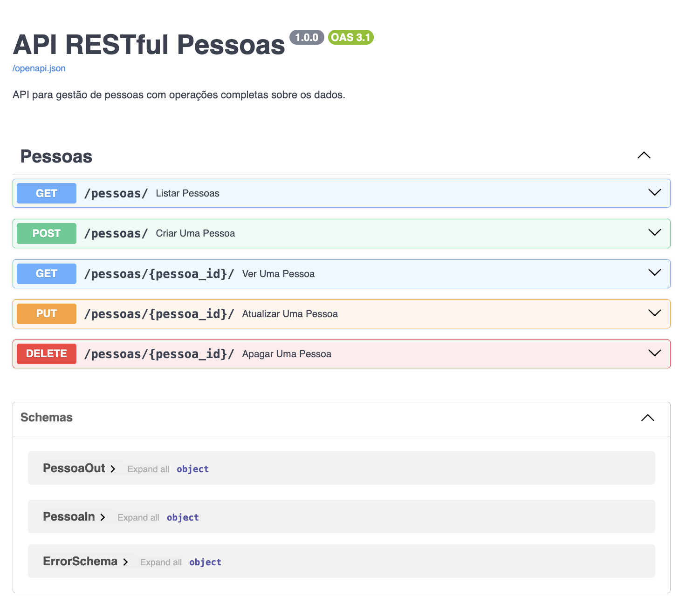

# API RESTful Pessoas




### Passos de Instalação

```
python -m venv venv
```

```
venv/Script/activate  # Windows
```

```
pip install -r requirements.txt
```

```
python manage.py runserver
```


### Defesa

Indicações:
* veja documentação Swagger em `http://127.0.0.1:8000/docs`, para conferir se é semelhante à imagem do readme (ficheiro api.png)

* teste cada um dos endpoints usando o swagger, para verificar se faz o esperado

* analise os ficheiros schemas.py e api.py

Implemente de modo a que fique correta, e identifique em baixo as alterações que fez, para as mostrar ao seu docente:

* ...

* ...


